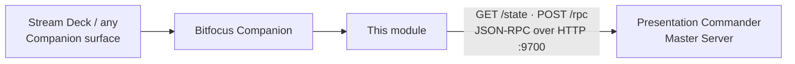

# companion-module-presentationcommander-server

> **AI-assisted project.** This codebase was created with [Claude](https://claude.com/claude-code)
> (Anthropic), directed and reviewed by a human author — including implementation
> and documentation. Review it accordingly before relying on it in production.

A [Bitfocus Companion](https://bitfocus.io/companion) connection module for
[Presentation Commander](https://github.com/stoatworks-labs/presentation-commander-server) —
control a running Master Server from a Stream Deck or any other Companion
surface: route outputs, recall scenes, blackout, send stage notes, and
drive next/previous slide on connected Client Nodes.

It talks to the Master Server's existing JSON-RPC automation API (`:9700`)
over plain HTTP — no separate integration to install on the server side.



<!-- downloads:start -->

## Download

**[v1.0.0](https://github.com/stoatworks-labs/companion-module-presentationcommander-server/releases/tag/v1.0.0)**

This release contains:

- [`companion-module-presentationcommander-server-pkg.tgz`](https://github.com/stoatworks-labs/companion-module-presentationcommander-server/releases/latest/download/companion-module-presentationcommander-server-pkg.tgz) — npm package, 5 KB
- [`presentationcommander-server-1.0.0.tgz`](https://github.com/stoatworks-labs/companion-module-presentationcommander-server/releases/download/v1.0.0/presentationcommander-server-1.0.0.tgz) — npm package, 5 KB

All builds, checksums and release notes: [github.com/stoatworks-labs/companion-module-presentationcommander-server/releases](https://github.com/stoatworks-labs/companion-module-presentationcommander-server/releases).

<!-- downloads:end -->

## What it does

- **Actions** — Route Output, Blackout Output, Recall Scene to Output, Send
  Note to Stage, Next Slide, Previous Slide. Every output/scene/source/client
  dropdown is populated live from the Master Server's current state, so the
  list always matches what's actually configured — no hand-typed ids.
- **Feedbacks** — *Output is routed to a specific source/scene* (highlight a
  button when a given output is showing what you expect) and *Client Node
  is online* (highlight while a given presentation laptop is connected).
- **Variables** — `connection_status`, `client_count`, and one
  `routed_<output-id>` variable per output holding the name of whatever
  it's currently routed to (or `Unrouted`).
- Polls the Master Server every 3 seconds; action/feedback/variable choice
  lists and values refresh automatically as outputs, scenes, sources, or
  clients change.

## Documentation

| Doc | Contents |
|---|---|
| [docs/USER-GUIDE.md](docs/USER-GUIDE.md) | Building a surface, and where the feedbacks can mislead you |
| [docs/API.md](docs/API.md) | Every action, feedback and variable, the config fields, and the poll loop |
| [docs/DEVELOPING.md](docs/DEVELOPING.md) | The three-repo protocol, the module conventions, and the behaviours to preserve |

## Setup

1. Install and enable this module in Companion (see **Installing** below).
2. Add a new connection using it, and set:
   - **Master Server host** — the machine running Presentation Commander
     Master Server (default `127.0.0.1`, i.e. Companion running on the same
     machine as the Master Server).
   - **Automation API port** — default `9700`, matches the Master Server's
     built-in automation API.
3. The connection should go green once it can reach `GET /state`.

### If Companion runs on a different machine

The Master Server's automation API listens on `127.0.0.1` only by
design — it executes routing/scene commands with no authentication, so
exposing it to the network is a deliberate operator choice, not something
Presentation Commander defaults to. If your Stream Deck / Companion install
is on a separate machine from the Master Server, reach port `9700` via an
SSH tunnel or a reverse proxy that adds its own authentication, then point
this module's **Master Server host**/**port** fields at that tunnel/proxy
instead of the raw port.

## Installing (not yet in the Companion module store)

### From a packaged release

A GitHub Actions [release workflow](.github/workflows/release.yml) packages the
module into the distributable `.tgz` via `companion-module-build` whenever a
`v*` tag is pushed (or the workflow is run manually from the Actions tab). Grab
the `.tgz` from the [Releases page](https://github.com/stoatworks-labs/companion-module-presentationcommander-server/releases)
once one is published, and import it via Companion's module-import UI
(**Modules → Import module package** in current Companion versions). You can
also build the same package locally with `npm install && npm run package`.

### As a local developer module

```sh
git clone https://github.com/stoatworks-labs/companion-module-presentationcommander-server.git
cd companion-module-presentationcommander-server
npm install
```

Then in Companion: **Settings → Developer Modules** (or the equivalent for
your Companion version) → add this directory as a local module.

## Relationship to the rest of Presentation Commander

- [presentation-commander-server](https://github.com/stoatworks-labs/presentation-commander-server) —
  the Master Server this module controls. Its `src/main/services/automationApi.ts`
  is the HTTP surface this module talks to (`GET /state`, `POST /rpc`),
  shared with the in-app Control Surface panel so both paths behave
  identically.
- [presentation-commander-client](https://github.com/stoatworks-labs/presentation-commander-client) —
  the Client Node app that runs on each presentation laptop; `next-slide`/
  `previous-slide` actions here are forwarded to whichever Client Node you
  target.

## Roadmap / TODO

- [ ] Submit to the official Bitfocus Companion module store (currently install-as-local-developer-module only, see "Installing" above).

## What changed in 1.1.0

**New: presets**, generated from the Master Server's live outputs, sources,
scenes and clients — one section per output containing a button per routable
target with tally already wired, one section for the Client Nodes, and stage
notes.

Two details worth knowing about them:

- The blackout preset lights off the **same** routing feedback as the crosspoint
  buttons, comparing against the empty target. The server represents "unrouted"
  as a null `routedSourceId`, so no separate feedback was needed.
- Slide buttons light from whether the **Client Node is online**, not from
  whether the slide advanced. The server forwards next/previous to a client only
  if it is connected, and otherwise steps its own counter and still reports
  success — online is the only honest signal available.

**New: `npm test`** — drives the real source against a fake automation API on a
real HTTP server, covering the generated presets, the tally feedbacks, and a
rejected command being treated as a failure rather than a success.

## License

MIT
